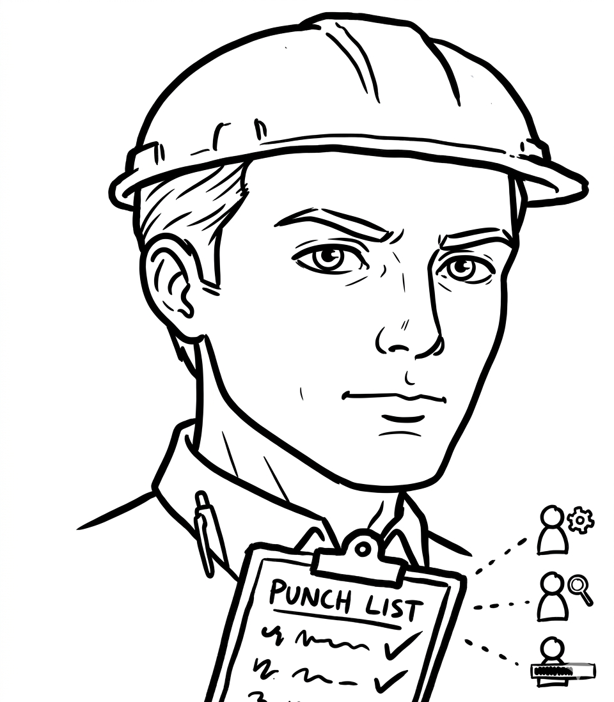

  

  <h1>foreman</h1>

  
<em>Hand him the list. He works it down. He signs off.</em>

He doesn't ask which bug to start with. He reads the punch list, sizes up each
item, and gets to work — fixing what's clear, sending a crew ahead to scout what
isn't, and walking off only when a call is above his pay grade. One commit per
item. One note in the log per item. The site is clean when he leaves.

`foreman` is the loop. [`ponytail`](../ponytail) is how each fix gets built —
the lazy senior dev `foreman` keeps on the crew.

## The job

Without him, you babysit a backlog: triage it yourself, fix one, remember to
review the diff, spin up the app to check it, write the ticket comment, repeat.
Drop context once and an item slips.

With him, you hand over a Linear ticket and a list. He branches off latest main,
triages by confidence, and runs the loop until the list is done or he needs you —
keeping his own notes outside the repo so a `/compact` never loses the thread.

## How it works

He works one item at a time, and reaches for a crew of parallel agents whenever
the scouting is independent.

1. **Set up.** Confirm `ponytail` is on, get the parent Linear ticket, land on a
   fresh worktree off latest main, take the list (a file or chat).
2. **Triage.** 90%-obvious fix → queue it. Ambiguous or a judgment call → a quick
   `/brainstorming` round that either settles it or escalates it.
3. **Root-cause.** Verify the cause in the real code, logs, or DB. No guessing.
4. **Fix with `ponytail`.** Shortest change that works. One plain line on what was
   wrong and what changed.
5. **One commit.** Scoped to that item.
6. **`/ponytail-review`** the diff and take the cuts.
7. **Verify by whatever fits** — Playwright for a screen, `curl` + logs for an
   endpoint, an assert for logic. New bugs found here go on the backlog.
8. **Sign off.** One concise Linear comment: what was wrong, what was fixed, how.
9. **Stuck?** To the backlog with an RCA, and on to the next item.

He stops the loop only where he needs your call. Substantial design decisions get
surfaced in chat — and, if you want, spun into a Linear sub-issue for the team.

When the list is done: a `ponytail-audit` over the whole diff, an optional
`code-review`, and a finalized PR with a table of what shipped and what's deferred.

## Commands

| Trigger | What it does |
|---|---|
| `/foreman` | Start the loop — asks for the ticket and the list. |
| "run the foreman loop" | Same, in plain words. |
| "work this punch list" | Same, with the list already in hand. |

## What's non-negotiable

- Root-cause before fixing. Verify before signing off — evidence, not assertion.
- One commit and one Linear comment per item.
- Plans and notes live in `~/.claude/tmp/<ticket>/`, never in the repo.
- Autonomous until genuinely blocked. He won't ask what he can default.

## FAQ

**Does he ask before every fix?**
No. He fixes what he's sure of and only walks over when a decision is yours.

**What if he breaks something while checking his work?**
It goes on the backlog with an RCA. He doesn't quietly fold it into the open fix.

**Will he commit the plan file?**
No. The paperwork stays in `~/.claude/tmp/`. Only the work lands in the repo.

**Does he need `ponytail`?**
Yes. `ponytail` is the hand that writes each fix. `foreman` runs the day.

See [`SKILL.md`](./SKILL.md) for the full process.
